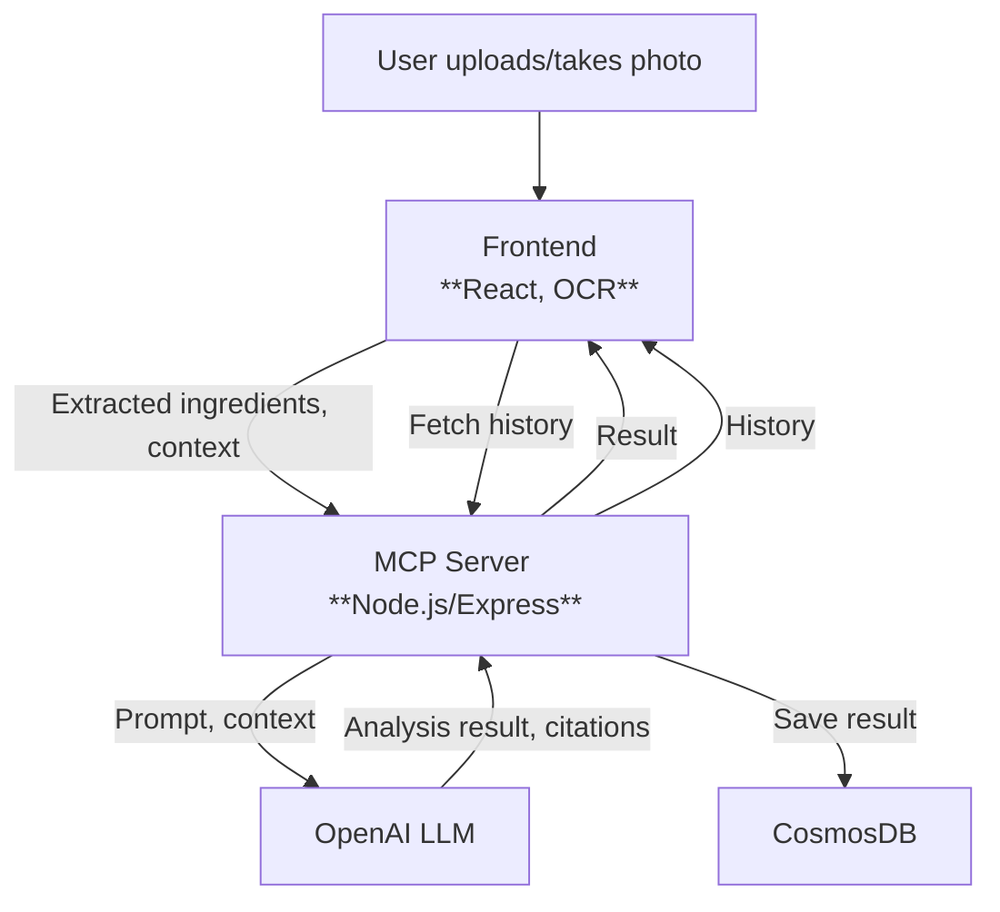
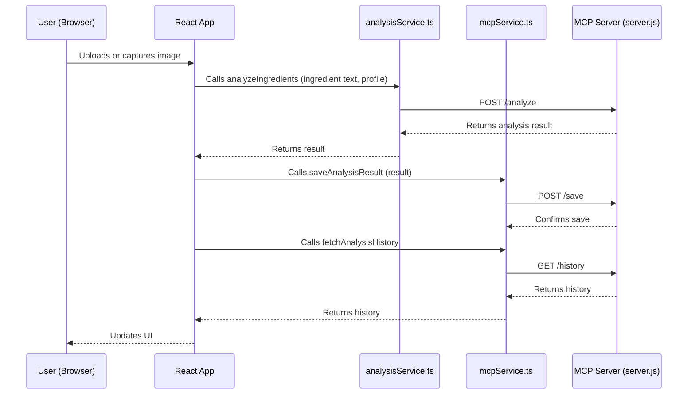

# Baby Food Analyzer(NutriTod)

A modern web application that analyzes baby food ingredients for toddlers (1–3 years) using OCR, AI, and the Model Context Protocol (MCP) pattern.

---

## Table of Contents

- [Baby Food Analyzer(NutriTod)](#baby-food-analyzernutritod)
  - [Table of Contents](#table-of-contents)
  - [What is MCP?](#what-is-mcp)
  - [MCP Terminology in This Solution](#mcp-terminology-in-this-solution)
    - [In-Context Example](#in-context-example)
    - [Visual Mapping](#visual-mapping)
  - [System Architecture](#system-architecture)
    - [High-Level MCP System Diagram](#high-level-mcp-system-diagram)
  - [How the Frontend and Backend Communicate](#how-the-frontend-and-backend-communicate)
    - [Service Usage Flow](#service-usage-flow)
  - [Features](#features)
  - [Getting Started](#getting-started)
    - [Prerequisites](#prerequisites)
    - [Installation](#installation)
  - [Deployment](#deployment)
  - [Technologies Used](#technologies-used)
  - [License \& Disclaimer](#license--disclaimer)

---

## What is MCP?

**Model Context Protocol (MCP)** is a design pattern for building robust, AI-powered applications. It separates:
- The **frontend** (UI, user input, display)
- The **backend** (model orchestration, business logic, data storage)
- The **protocol** (the contract for how frontend and backend communicate, including context, actions, and results)

MCP ensures that LLMs (like OpenAI) are used behind a well-defined API, making your app maintainable and scalable.
## MCP Terminology in This Solution

Here’s how the general MCP concepts map to this project:

| MCP Concept         | In This Solution (Baby Food Analyzer)                                                                 |
|---------------------|------------------------------------------------------------------------------------------------------|
| **MCP Host**        | The user’s web browser running the React app (the “host” that initiates analysis and history fetches) |
| **MCP Client**      | The code in your React frontend (e.g., `analysisService.ts`, `mcpService.ts`) that sends HTTP requests to the MCP server |
| **MCP Server**      | Your Node.js/Express backend (`server.js`) that exposes `/analyze`, `/save`, and `/history` endpoints |
| **Local Data Source** | (Not used in this demo, but could be local files/databases if the server accessed them)              |
| **Remote Service**  | The OpenAI API (LLM) and CosmosDB, which your MCP server connects to for analysis and storage         |

### In-Context Example

- **MCP Host:**  The React web app running in the user’s browser, where the user uploads images and views results.
- **MCP Client:**  The frontend service modules (`analysisService.ts` and `mcpService.ts`) that communicate with the backend using the MCP protocol (HTTP+JSON).
- **MCP Server:**  The Node.js/Express app (`server.js`) that receives requests, orchestrates LLM calls, and manages data storage.
- **Local Data Source:**  (Not present in this solution, but if your server accessed files on disk or a local database, those would be local data sources.)
- **Remote Service:**  
  - **OpenAI API:** Used by the MCP server to analyze ingredients.
  - **CosmosDB:** Used by the MCP server to store and retrieve analysis history.

### Visual Mapping

```plaintext
[Browser/React App]  <--MCP Client-->  [MCP Server (Node.js/Express)]  <--->  [OpenAI API, CosmosDB]
      |                                         |                                 (Remote Services)
      |                                         |
      |-- User interacts, triggers analysis ---> |-- Calls LLM, stores/fetches --> |
```

---

## System Architecture

> **Note:** Mermaid diagrams may not render on GitHub.  
> Use VS Code with the Mermaid extension or [Mermaid Live Editor](https://mermaid.live/) to view.

### High-Level MCP System Diagram



---

## How the Frontend and Backend Communicate

The React frontend uses two service modules to interact with the MCP server:

- **`analysisService.ts`**: Handles the initial ingredient analysis. When a user uploads or captures an image, the frontend extracts the text and calls `analyzeIngredients`, which sends a POST request to the MCP server's `/analyze` endpoint.
- **`mcpService.ts`**: Handles saving analysis results and fetching analysis history. After receiving the analysis result, the frontend calls `saveAnalysisResult` (to `/save`) and `fetchAnalysisHistory` (to `/history`).

**The server never calls these services directly—they are HTTP clients used by the frontend.**

### Service Usage Flow



---

## Features

- Take a photo or upload an image of food ingredient labels
- Extract text from images using OCR
- Analyze ingredients using AI to determine if they're suitable for babies
- Personalized analysis based on baby's age and allergies
- Flag concerning ingredients with scientific citations
- Provide nutritional information and healthier alternatives
- Store history of previous analyses
- Simple, responsive design for both mobile and desktop

---

## Getting Started

### Prerequisites

- Node.js (v14 or higher)
- npm (v6 or higher)

### Installation

1. Clone the repository:
   ```sh
   git clone https://github.com/yourusername/baby-food-analyzer.git
   cd baby-food-analyzer
   ```

2. Install dependencies:
   ```sh
   npm install
   ```

3. (Optional) Add your OpenAI API key if you want to use direct LLM calls for development/testing.

4. Start the development server:
   ```sh
   npm start
   ```

5. Open [http://localhost:3000](http://localhost:3000) to view the app in your browser.

---

## Deployment

This app can be easily deployed to Vercel:

1. Push your code to GitHub
2. Connect your GitHub repository to Vercel
3. Deploy!

---

## Technologies Used

- React with TypeScript
- Tailwind CSS for styling
- Tesseract.js for OCR
- OpenAI API for ingredient analysis
- CosmosDB for persistent storage
- Node.js/Express MCP server

---

## License & Disclaimer

**License:** MIT

**Disclaimer:**  
This app is for informational purposes only and should not replace professional medical advice about your baby's nutrition.
