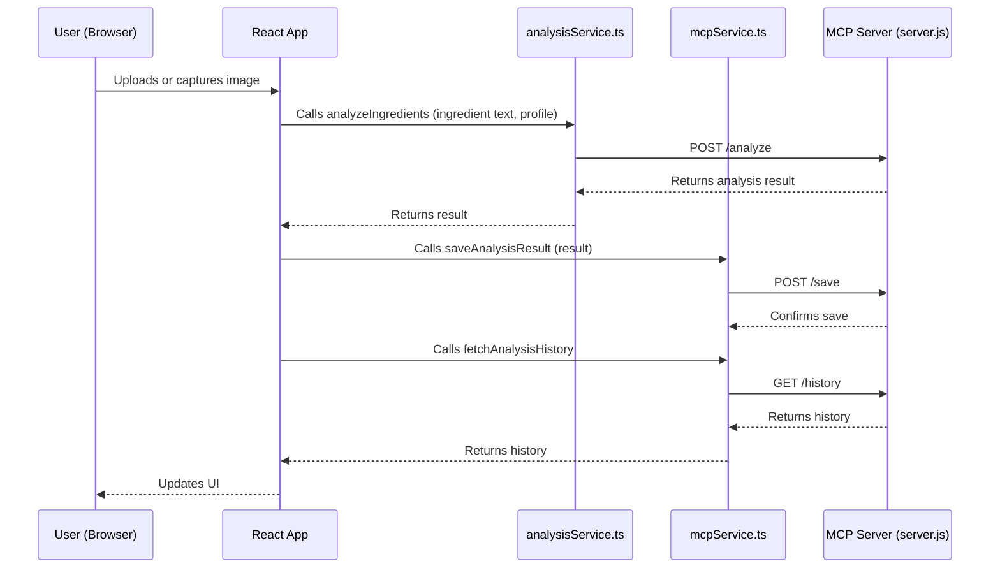

# Baby Food Analyzer

A web application that analyzes baby food ingredients to determine if they're healthy for babies aged 1-3 years.

## How the Frontend Services Work Together

The React frontend uses two service modules to communicate with the MCP server:

- **`analysisService.ts`**: Handles the initial ingredient analysis. When a user uploads or captures an image, the frontend extracts the text and calls `analyzeIngredients` from this service, which sends a POST request to the MCP server's `/analyze` endpoint. The server returns the analysis result.

- **`mcpService.ts`**: Handles saving analysis results and fetching analysis history. After receiving the analysis result, the frontend calls `saveAnalysisResult` to persist it (via the `/save` endpoint), and uses `fetchAnalysisHistory` to retrieve past results (via the `/history` endpoint).

```
[Browser/React App]
     |
     |  (calls analyzeIngredients in analysisService.ts)
     v
[analysisService.ts]  --HTTP-->  [MCP Server (server.js) on :3001]
     ^
     |  (calls saveAnalysisResult, fetchAnalysisHistory in mcpService.ts)
     |
[mcpService.ts]  --HTTP-->  [MCP Server (server.js) on :3001]
```

**The server never calls these services directly—they are HTTP clients used by the frontend.**

### System Diagram (MCP Pattern)

```mermaid
flowchart TD
    A[User uploads/takes photo] --> B[Frontend (React, OCR)]
    B -->|Extracted ingredients, context| C[MCP Server (Node.js/Express)]
    C -->|Prompt, context| D[OpenAI LLM]
    D -->|Analysis result, citations| C
    C -->|Result| B
    C -->|Save result| E[CosmosDB]
    B -->|Fetch history| C
    C -->|History| B
```

### Service Usage Flow




## Features

- Take a photo or upload an image of food ingredient labels
- Extract text from images using OCR
- Analyze ingredients using AI to determine if they're suitable for babies
- Personalized analysis based on baby's age and allergies
- Flag concerning ingredients with scientific citations
- Provide nutritional information and healthier alternatives
- Store history of previous analyses
- Simple, responsive design for both mobile and desktop

## Getting Started

### Prerequisites

- Node.js (v14 or higher)
- npm (v6 or higher)

### Installation

1. Clone the repository:
   ```
   git clone https://github.com/yourusername/baby-food-analyzer.git
   cd baby-food-analyzer
   ```

2. Install dependencies:
   ```
   npm install
   ```

3. Add your OpenAI API key:
   - Open `src/services/analysisService.ts`
   - Update the `API_KEY` variable with your OpenAI API key

4. Start the development server:
   ```
   npm start
   ```

5. Open [http://localhost:3000](http://localhost:3000) to view the app in your browser.

## Deployment

This app can be easily deployed to Vercel:

1. Push your code to GitHub
2. Connect your GitHub repository to Vercel
3. Deploy!

## Technologies Used

- React with TypeScript
- Tailwind CSS for styling
- Tesseract.js for OCR
- OpenAI API for ingredient analysis
- Local Storage for saving analysis history

## License

MIT

## Disclaimer

This app is for informational purposes only and should not replace professional medical advice about your baby's nutrition.
